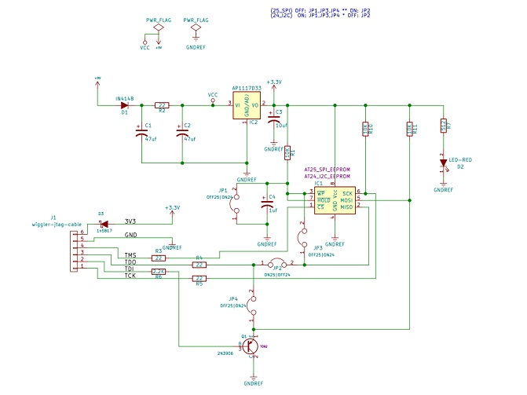
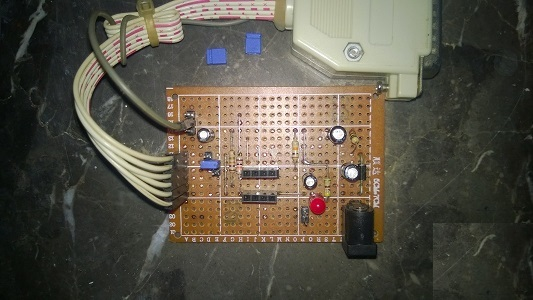

# Wiggle jtag cable spi flash programmer
 
> 尝试在linux上使用ch341编程器，它很便宜，但并没找到合适的软件，后来还给公司了。
>
> 常常会玩些电子垃圾磨时光，总会切换到 windows 去刷 flash。因手里还剩下一只 Parallel Wiggle jtag 又正好看到一个使用并口来编程 **spi flash** 的页面。
>
> [spi-flash-programmer][spi-flash-programmer_link]
>
>这里稍作修改以使它可以编程 winband spi flash 和 24c01/08 i2c eeprom

#
> **电路图**
> 

#

>    **实物**
>    
>    便宜的洞洞板制作
>    
>

#

> **注意**
>* 在获得id等于 0 或者 0xFFFFFF 表示线路连接有问题，或者芯片不能读。
>* spi flash 编程的流程应该是先擦除再写入。
>* 未能充分测试，请自行效验编程数据是否正确。

#

[spi-flash-programmer_link]:    <http://www.malinov.com/Home/sergeys-projects/spi-flash-programmer>